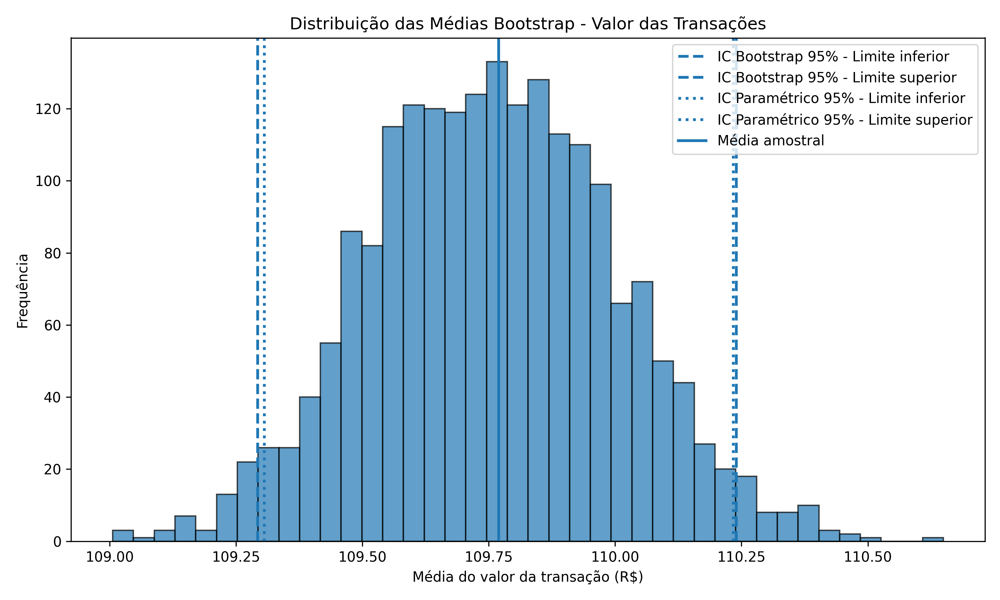
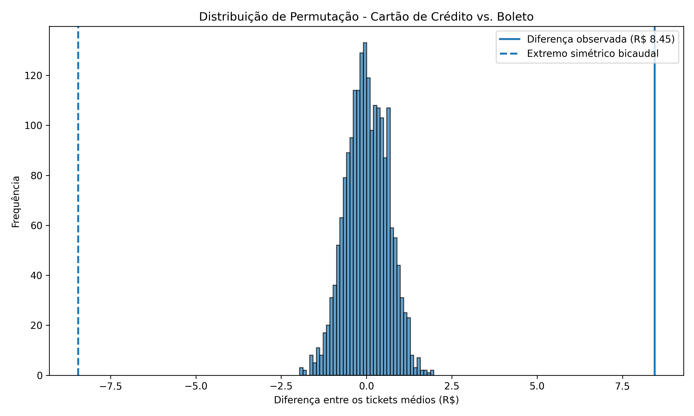
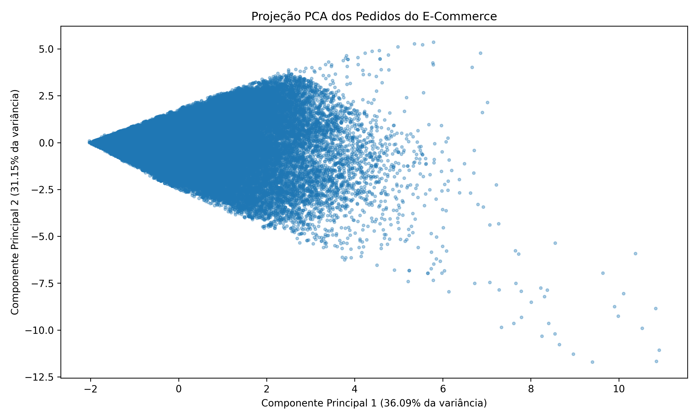
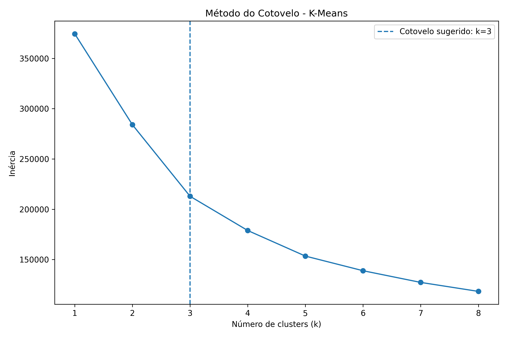
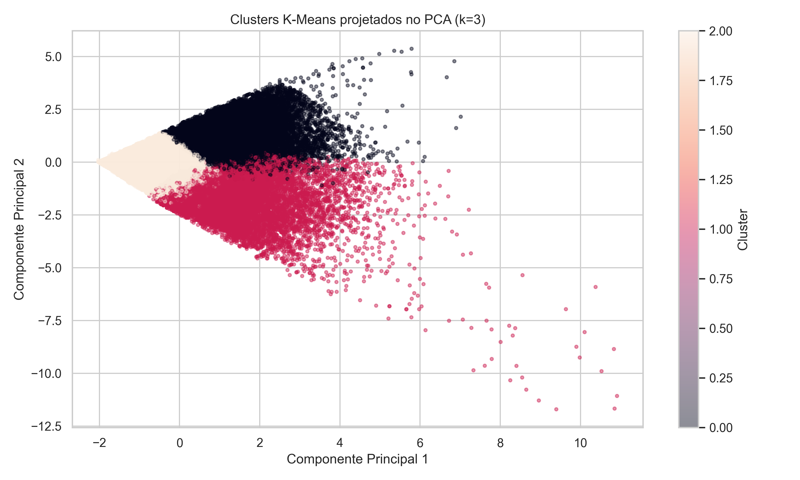

# Relatório Científico: Ciência de Dados Aplicada ao E-Commerce Brasileiro — Olist

Este projeto implementa um pipeline completo e reprodutível de Ciência de Dados aplicado ao domínio de Finanças e E-Commerce, utilizando o Brazilian E-Commerce Public Dataset by Olist.

O trabalho foi desenvolvido em duas etapas integradas:

- **AVP1:** ingestão, tratamento, análise exploratória, IQR, tratamento de nulos, integração de tabelas e visualização científica;
- **AVP2:** Bootstrap, Intervalos de Confiança, Teste A/B, Teste de Permutação, Regressão Linear Múltipla, Classificação, GridSearchCV, PCA, K-Means e análise causal.

## Membros

- Luiz Henrique
- David Reis
- Kauã Sousa

---

# 1. Fonte de Dados

O projeto utiliza o conjunto de dados público da Olist, que contém informações referentes a pedidos realizados em uma plataforma brasileira de e-commerce entre 2016 e 2018.

O pipeline utiliza principalmente as seguintes tabelas:

- `olist_orders_dataset.csv`
- `olist_order_payments_dataset.csv`
- `olist_order_reviews_dataset.csv`
- `olist_customers_dataset.csv`

Essas tabelas são integradas por meio das chaves `order_id` e `customer_id`.

Os dados brutos são armazenados localmente na pasta `data/`, que não é versionada no Git por possuir arquivos grandes e por representar a camada bruta do projeto.

---

# 2. População-Alvo, Access Frame e Viés de Seleção

## 2.1 População-Alvo Ideal

A população-alvo ideal para compreender o comportamento do e-commerce brasileiro seria composta por todas as transações comerciais digitais realizadas no território nacional, abrangendo diferentes marketplaces, empresas, categorias de produtos, regiões e perfis de consumidores.

## 2.2 Estrutura de Acesso Real — Access Frame

A estrutura de acesso disponível é mais limitada. O dataset representa pedidos realizados através do ecossistema da Olist entre 2016 e 2018.

Portanto, a base observada não representa necessariamente todo o comércio eletrônico brasileiro.

## 2.3 Riscos de Viés de Seleção

Há diferentes possibilidades de viés:

1. **Viés de plataforma:** são analisadas apenas transações pertencentes ao ecossistema Olist.
2. **Viés geográfico:** algumas regiões possuem maior presença de consumidores e vendedores do que outras.
3. **Viés temporal:** os dados correspondem a um período específico de 2016 a 2018.
4. **Viés de perfil empresarial:** empresas que utilizam a Olist podem possuir características diferentes de grandes varejistas com infraestrutura própria.

Consequentemente, generalizações para todo o e-commerce brasileiro devem ser realizadas com cautela.

---

# 3. Extração e Consolidação dos Dados

O módulo `src/extract/extractor.py` realiza a leitura automatizada dos arquivos CSV e verifica previamente se os arquivos necessários estão disponíveis.

Após a leitura, as colunas temporais são convertidas para `datetime`.

Em seguida, são realizados os seguintes cruzamentos:

1. pedidos + clientes;
2. resultado + pagamentos;
3. resultado + avaliações.

Na execução completa do pipeline, a base bruta consolidada apresentou:

- **104.478 registros**
- **22 variáveis**

O resultado é encaminhado para a etapa de tratamento estatístico.

---

# 4. Tratamento Estatístico e Análise Exploratória

O módulo `src/transform/cleaner.py` realiza o tratamento de valores ausentes, criação de novas variáveis e isolamento de outliers.

## 4.1 Tratamento de Valores Nulos

Para `review_score`, foi utilizada imputação pela mediana.

Para os campos textuais:

- `review_comment_title`
- `review_comment_message`

os valores nulos são substituídos por strings vazias.

Registros sem uma data válida de entrega não podem produzir corretamente a variável `tempo_entrega_dias` e, por isso, são removidos da análise.

### Viés vs. Variância

A imputação pela mediana evita redução excessiva da amostra e é robusta à presença de valores extremos. Entretanto, introduz artificialmente observações próximas à tendência central, podendo reduzir a variabilidade observada.

A exclusão de registros, por outro lado, evita criar informações artificiais, mas reduz o tamanho efetivo da amostra e pode aumentar a variância das estimativas.

---

# 5. Dicionário de Dados

Algumas das principais variáveis utilizadas no projeto são:

| Variável                        | Tipo Estatístico      | Descrição                           |
| ------------------------------- | --------------------- | ----------------------------------- |
| `order_id`                      | Categórica nominal    | Identificador do pedido             |
| `customer_state`                | Categórica nominal    | Estado do consumidor                |
| `payment_type`                  | Categórica nominal    | Forma de pagamento                  |
| `payment_value`                 | Quantitativa contínua | Valor do pagamento em reais         |
| `payment_installments`          | Quantitativa discreta | Número de parcelas                  |
| `review_score`                  | Quantitativa discreta | Avaliação do consumidor entre 1 e 5 |
| `tempo_entrega_dias`            | Quantitativa discreta | Tempo entre compra e entrega        |
| `order_purchase_timestamp`      | Temporal              | Data da compra                      |
| `order_delivered_customer_date` | Temporal              | Data real da entrega                |
| `order_estimated_delivery_date` | Temporal              | Data prevista para entrega          |

---

# 6. Tratamento de Outliers pelo Intervalo Interquartil — IQR

O método do Intervalo Interquartil foi aplicado à variável `payment_value`.

Os valores encontrados foram:

- **Q1:** R$ 56,78
- **Q3:** R$ 171,09
- **IQR:** R$ 114,31

O limite superior foi calculado como:

\[
LimiteSuperior = Q3 + 1,5 \times IQR
\]

\[
LimiteSuperior = 171,09 + 1,5 \times 114,31
\]

\[
LimiteSuperior = 342,57
\]

O limite inferior encontrado foi de aproximadamente **-R$ 114,69**.

Como valores financeiros negativos não aparecem nesse contexto, o principal corte efetivo ocorreu no limite superior.

Foram removidos:

- **7.736 registros considerados outliers**

Após o tratamento, a base final ficou com:

- **93.588 registros**

O arquivo consolidado é salvo automaticamente como:

`dados_limpos_final.csv`

---

# 7. Bootstrap e Estimação de Parâmetros

O módulo `src/inference/bootstrap.py` utiliza a variável contínua `payment_value` para estimar o valor médio das transações.

## 7.1 Estatísticas Amostrais

Foram encontrados:

- **N = 93.588**
- **Média amostral = R$ 109,77**
- **Desvio padrão amostral = R$ 72,43**

## 7.2 Reamostragem Bootstrap

Foram realizadas **2.000 reamostragens com reposição**.

Cada réplica Bootstrap possui o mesmo tamanho da amostra original e produz uma nova média.

A partir das 2.000 médias simuladas foi construída uma distribuição empírica da média amostral.

## 7.3 Intervalo de Confiança Bootstrap

Utilizando os percentis 2,5% e 97,5%:

- **IC 95% Bootstrap: R$ 109,29 a R$ 110,24**

## 7.4 Intervalo de Confiança Paramétrico

O intervalo tradicional foi calculado por:

\[
IC\_{95\%} = \bar{X} \pm 1,96 \frac{s}{\sqrt{N}}
\]

Resultado:

- **IC 95% Paramétrico: R$ 109,31 a R$ 110,23**

Os dois métodos apresentaram resultados extremamente próximos.

## 7.5 Teorema Central do Limite

Embora a variável `payment_value` apresente variabilidade individual considerável, o tamanho amostral é muito elevado:

- **N = 93.588**

Pelo Teorema Central do Limite, sob condições usuais de independência e variância finita, a distribuição da média amostral tende a uma distribuição aproximadamente normal conforme o tamanho da amostra aumenta.

O formato aproximadamente simétrico da distribuição das 2.000 médias Bootstrap e a forte proximidade entre os dois intervalos de confiança são compatíveis com esse comportamento.

Isso não significa que a distribuição original de `payment_value` precisa ser normal. O TCL refere-se principalmente à distribuição amostral da média.



---

# 8. Teste A/B e Teste de Permutação

O módulo `src/inference/ab_testing.py` compara o ticket médio de duas formas de pagamento.

## 8.1 Definição dos Grupos

- **Grupo A:** Cartão de Crédito
- **Grupo B:** Boleto Bancário

A variável analisada é:

- `payment_value`

A pergunta de pesquisa é:

**Existe diferença estatisticamente significativa entre o ticket médio das compras realizadas por cartão de crédito e por boleto?**

## 8.2 Hipóteses

Hipótese Nula:

\[
H*0: \mu*{cartão} = \mu\_{boleto}
\]

Hipótese Alternativa:

\[
H*1: \mu*{cartão} \neq \mu\_{boleto}
\]

Foi utilizado:

\[
\alpha = 0,05
\]

## 8.3 Resultados Observados

### Cartão de Crédito

- **68.641 registros**
- **Ticket médio = R$ 115,07**

### Boleto

- **18.059 registros**
- **Ticket médio = R$ 106,63**

A diferença observada foi:

\[
115,07 - 106,63 = R\$ 8,45
\]

Portanto, na amostra observada, pagamentos realizados com cartão apresentaram ticket médio aproximadamente **R$ 8,45 superior** ao boleto.

## 8.4 Teste de Permutação

Foram executadas **2.000 permutações** dos rótulos dos grupos.

O objetivo foi produzir a distribuição esperada das diferenças entre médias caso a hipótese nula fosse verdadeira.

Nenhuma das 2.000 permutações produziu diferença absoluta tão extrema quanto a diferença observada.

O programa apresentou:

- **p-value empírico calculado = 0,000000**

Como o teste utiliza somente 2.000 permutações, esse valor não deve ser interpretado como probabilidade matemática exatamente igual a zero. A interpretação adequada é que não foi observada nenhuma permutação tão extrema quanto o resultado real, sendo razoável reportar:

- **p < 0,0005**

Como:

\[
p < 0,05
\]

**rejeitamos H0.**

Há evidência estatística de diferença entre os tickets médios das duas formas de pagamento.

## 8.5 Significado para o Negócio

Os dados indicam que consumidores que utilizam cartão de crédito apresentam, em média, compras de maior valor do que consumidores que utilizam boleto.

Esse resultado pode auxiliar estratégias de:

- segmentação de consumidores;
- campanhas promocionais;
- políticas de parcelamento;
- incentivos de formas de pagamento.

Entretanto, o resultado representa uma **associação estatística**, e não prova que utilizar cartão de crédito cause aumento no valor da compra.



---

# 9. Regressão Linear Múltipla

O módulo `src/models/regression.py` investiga a relação entre satisfação, tempo de entrega e valor da transação.

A variável resposta utilizada foi:

\[
Y = review_score
\]

As variáveis preditoras foram:

\[
X_1 = tempo_entrega_dias
\]

\[
X_2 = payment_value
\]

O modelo estimado foi:

\[
review_score =
4,719898

- 0,044242 \times tempo_entrega_dias
- 0,000185 \times payment_value
  \]

## 9.1 Coeficientes

- **β0 = 4,719898**
- **β1 = -0,044242**
- **β2 = -0,000185**

## 9.2 Interpretação Ceteris Paribus

### Tempo de Entrega

Mantendo `payment_value` constante, cada dia adicional no tempo de entrega está associado a uma redução média de aproximadamente:

- **0,044 ponto na avaliação**

Por exemplo, dez dias adicionais correspondem no modelo a aproximadamente:

\[
10 \times -0,044242 = -0,44242
\]

ou cerca de **0,44 ponto a menos na avaliação**, mantendo o restante constante.

### Valor do Pagamento

Mantendo o tempo de entrega constante, cada R$ 1 adicional em `payment_value` está associado a uma alteração de aproximadamente:

- **-0,000185 ponto**

O efeito estimado do valor financeiro é pequeno quando comparado ao coeficiente relacionado ao tempo de entrega.

## 9.3 Qualidade do Ajuste

O modelo apresentou:

- **R² = 0,1076**
- **RMSE = 1,2026**

O R² indica que aproximadamente **10,76% da variação nas avaliações** é explicada conjuntamente pelo tempo de entrega e pelo valor do pagamento.

O RMSE indica um erro típico de aproximadamente **1,20 ponto na escala de avaliação**.

O resultado mostra que as duas variáveis possuem poder explicativo limitado e que a satisfação também depende de fatores não incluídos no modelo, como:

- qualidade do produto;
- avarias;
- atendimento;
- expectativa do consumidor;
- valor do frete;
- categoria do produto;
- qualidade do vendedor.

Além disso, `review_score` possui escala discreta entre 1 e 5. A regressão linear foi aplicada para atender à análise quantitativa proposta, mas essa característica deve ser considerada como limitação na interpretação do modelo.

---

# 10. Classificação Supervisionada

O módulo `src/models/machine_learning.py` implementa uma tarefa de classificação binária.

O objetivo é prever:

- **0 = pedido entregue no prazo**
- **1 = pedido entregue atrasado**

A variável alvo é construída comparando:

- `order_delivered_customer_date`
- `order_estimated_delivery_date`

As variáveis preditoras utilizadas foram:

- `payment_value`
- `payment_installments`
- `prazo_estimado_dias`

Os dados foram padronizados utilizando `StandardScaler`.

## 10.1 Desbalanceamento das Classes

A base completa apresentou:

- **86.155 pedidos no prazo**
- **7.433 pedidos atrasados**

Isso representa forte desbalanceamento em favor da classe 0.

Para tornar o processamento do KNN e GridSearchCV computacionalmente viável, foi utilizada uma amostra estratificada de **30.000 registros**, preservando aproximadamente a proporção entre as classes.

A divisão utilizada foi:

- **24.000 registros para treinamento**
- **6.000 registros para teste**

---

# 11. Regressão Logística

Foi utilizado `GridSearchCV` com validação cruzada para selecionar os melhores hiperparâmetros.

Melhores parâmetros:

```text
C = 10.0
class_weight = balanced
```

Melhor F1 médio durante a validação cruzada:

- **0,1577**

## 11.1 Matriz de Confusão

```text
[[2912 2611]
 [ 228  249]]
```

Interpretação:

- 2.912 pedidos no prazo classificados corretamente;
- 2.611 pedidos no prazo classificados incorretamente como atrasados;
- 228 pedidos atrasados não identificados;
- 249 pedidos atrasados identificados corretamente.

## 11.2 Métricas

| Métrica  | Resultado |
| -------- | --------: |
| Acurácia |    52,68% |
| Precisão |     8,71% |
| Recall   |    52,20% |
| F1-Score |    14,92% |

Apesar da baixa precisão, o modelo conseguiu identificar aproximadamente metade dos pedidos efetivamente atrasados.

---

# 12. K-Vizinhos Mais Próximos — KNN

O segundo algoritmo utilizado foi o KNN.

Melhores hiperparâmetros encontrados:

```text
n_neighbors = 5
weights = distance
```

Melhor F1 médio na validação cruzada:

- **0,0783**

## 12.1 Matriz de Confusão

```text
[[5309  214]
 [ 454   23]]
```

Interpretação:

- 5.309 pedidos no prazo classificados corretamente;
- 214 pedidos no prazo classificados como atrasados;
- 454 atrasos não identificados;
- apenas 23 atrasos identificados corretamente.

## 12.2 Métricas

| Métrica  | Resultado |
| -------- | --------: |
| Acurácia |    88,87% |
| Precisão |     9,70% |
| Recall   |     4,82% |
| F1-Score |     6,44% |

---

# 13. Comparação entre Regressão Logística e KNN

| Métrica  | Regressão Logística |    KNN |
| -------- | ------------------: | -----: |
| Acurácia |              52,68% | 88,87% |
| Precisão |               8,71% |  9,70% |
| Recall   |              52,20% |  4,82% |
| F1-Score |              14,92% |  6,44% |

Embora o KNN apresente acurácia muito superior, esse resultado é fortemente influenciado pelo desbalanceamento das classes.

Como a grande maioria dos pedidos é entregue no prazo, um modelo pode alcançar uma acurácia alta simplesmente priorizando a classe majoritária.

O KNN identificou apenas **4,82% dos atrasos reais**.

A Regressão Logística apresentou menor acurácia geral, porém identificou **52,20% dos atrasos**, além de obter F1-Score superior.

Portanto, considerando um objetivo operacional de identificar pedidos potencialmente atrasados, a **Regressão Logística mostrou-se mais útil entre os dois modelos avaliados**.

Ainda assim, o desempenho geral indica que apenas `payment_value`, `payment_installments` e `prazo_estimado_dias` são insuficientes para uma previsão robusta de atrasos.

Variáveis adicionais poderiam melhorar os modelos, por exemplo:

- localização do consumidor;
- localização do vendedor;
- distância logística;
- categoria do produto;
- peso e dimensões;
- transportadora;
- características regionais.

---

# 14. Aprendizado Não Supervisionado

O módulo `src/models/unsupervised.py` implementa:

1. padronização;
2. PCA;
3. Método do Cotovelo;
4. K-Means;
5. análise dos perfis médios dos clusters.

Foram utilizadas:

- `payment_value`
- `payment_installments`
- `review_score`
- `tempo_entrega_dias`

---

# 15. PCA — Análise de Componentes Principais

Como as variáveis possuem escalas muito diferentes, inicialmente foi aplicado `StandardScaler`.

Após a padronização, foi aplicado PCA com dois componentes principais.

## 15.1 Fundamentação por SVD

A Análise de Componentes Principais busca novas direções ortogonais capazes de representar a maior quantidade possível da variabilidade existente nos dados.

Computacionalmente, o PCA pode ser fundamentado por **Decomposição em Valores Singulares — SVD**.

De forma simplificada, uma matriz de dados centralizada pode ser decomposta como:

\[
X = U \Sigma V^T
\]

onde:

- \(U\) representa vetores singulares à esquerda;
- \(\Sigma\) contém os valores singulares;
- \(V^T\) contém as direções principais associadas às variáveis.

As direções associadas aos maiores valores singulares concentram maior quantidade da variância da matriz.

Ao selecionar os dois primeiros componentes, reduzimos a representação original de quatro variáveis para duas dimensões, preservando a maior parcela possível da variabilidade segundo esse critério.

## 15.2 Variância Explicada

Os resultados encontrados foram:

- **PC1 = 36,09%**
- **PC2 = 31,15%**

Variância acumulada:

\[
36,09\% + 31,15\% = 67,24\%
\]

Portanto, os dois primeiros componentes preservam aproximadamente **67,24% da variância observada nas quatro variáveis utilizadas**.

Esse valor não representa acurácia. Ele representa a parcela da variabilidade original capturada pela projeção bidimensional.



---

# 16. K-Means e Método do Cotovelo

Foram testados valores de:

\[
k = 1,2,3,\ldots,8
\]

As inércias encontradas foram:

|   k |   Inércia |
| --: | --------: |
|   1 | 374352,00 |
|   2 | 283985,60 |
|   3 | 212887,92 |
|   4 | 178870,11 |
|   5 | 153452,57 |
|   6 | 138908,79 |
|   7 | 127289,47 |
|   8 | 118362,43 |

O comportamento da curva apresentou redução mais intensa até aproximadamente:

- **k = 3**

Assim, foram escolhidos três clusters.



---

# 17. Perfil dos Clusters

A distribuição encontrada foi:

- **Cluster 0: 20.988 registros**
- **Cluster 1: 13.793 registros**
- **Cluster 2: 58.807 registros**

Os valores médios foram:

| Cluster | Payment Value | Parcelas | Avaliação | Tempo de Entrega |
| ------- | ------------: | -------: | --------: | ---------------: |
| 0       |     R$ 191,34 |     5,68 |      4,51 |       11,45 dias |
| 1       |     R$ 112,37 |     2,35 |      1,66 |       21,88 dias |
| 2       |      R$ 80,05 |     1,61 |      4,64 |        9,83 dias |

## 17.1 Cluster 0 — Compras de Maior Valor

Características:

- maior ticket médio;
- maior quantidade de parcelas;
- boa avaliação;
- tempo intermediário de entrega.

Esse grupo representa compras financeiramente maiores e mais parceladas, mantendo nível elevado de satisfação.

## 17.2 Cluster 1 — Entrega Lenta e Baixa Satisfação

Características:

- ticket intermediário;
- poucas parcelas;
- avaliação média muito baixa;
- maior tempo médio de entrega.

Esse é o grupo operacionalmente mais preocupante.

Apresentou:

- **review_score médio = 1,66**
- **tempo de entrega médio = 21,88 dias**

## 17.3 Cluster 2 — Compras Menores, Rápidas e Bem Avaliadas

Características:

- menor ticket médio;
- menor quantidade de parcelas;
- melhor avaliação média;
- menor tempo de entrega.

Apresentou:

- **review_score médio = 4,64**
- **tempo de entrega médio = 9,83 dias**

Além disso, é o maior cluster da análise.



---

# 18. Inferência Causal

Os resultados encontrados pelos modelos representam relações estatísticas observadas nos dados, mas não permitem automaticamente estabelecer relações causais.

## 18.1 Tempo de Entrega e Avaliação

A regressão encontrou associação negativa entre tempo de entrega e avaliação:

- **β = -0,044242 por dia**

Além disso, o Cluster 1 apresentou simultaneamente:

- maior tempo de entrega;
- menor avaliação.

Esses resultados reforçam a existência de uma relação estatística entre as variáveis.

Entretanto:

**correlação e capacidade preditiva não são evidência suficiente de causalidade.**

Não é possível afirmar apenas com esses dados observacionais que aumentar o tempo de entrega, isoladamente, causa redução na avaliação.

---

# 19. Possíveis Variáveis de Confusão

Diversos fatores podem afetar simultaneamente o tempo de entrega e a satisfação.

## 19.1 Valor do Frete

Clientes localizados em regiões mais distantes podem apresentar:

- maiores custos logísticos;
- entregas mais demoradas.

Ao mesmo tempo, o valor do frete pode afetar negativamente a percepção da compra.

## 19.2 Categoria do Produto

Produtos frágeis, pesados ou de maior complexidade podem:

- necessitar de logística diferenciada;
- apresentar prazo maior;
- possuir maior risco de avaria;
- gerar avaliações diferentes.

## 19.3 Região Geográfica

Infraestrutura logística e distância entre vendedor e cliente podem afetar diretamente o tempo de entrega e também influenciar custos e experiência do consumidor.

## 19.4 Qualidade do Produto e do Vendedor

Avaliações baixas também podem ocorrer por:

- produto diferente do esperado;
- defeitos;
- embalagem inadequada;
- atendimento;
- comunicação do vendedor.

Esses fatores podem ser responsáveis por parte da relação observada entre entrega e avaliação.

---

# 20. Ceteris Paribus e Desenho Causal Ideal

Para investigar causalmente o efeito do tempo de entrega, seria necessário comparar pedidos semelhantes mantendo os demais fatores constantes.

Um desenho ideal deveria controlar, entre outros:

- produto;
- preço;
- frete;
- região;
- vendedor;
- categoria;
- características do consumidor.

Em um experimento hipotético, pedidos comparáveis poderiam ser aleatoriamente destinados a diferentes condições de entrega.

Se todas as demais condições fossem equivalentes, diferenças sistemáticas na avaliação poderiam ser atribuídas com maior segurança ao tempo de entrega.

Na prática, manipular deliberadamente atrasos seria problemático do ponto de vista operacional e ético. Portanto, métodos observacionais de controle de confundidores, pareamento ou desenhos quase-experimentais poderiam ser alternativas mais adequadas.

---

# 21. Tomada de Decisão Operacional

Os resultados dos clusters indicam que o **Cluster 1** merece atenção prioritária.

Esse grupo possui:

- tempo médio de entrega de **21,88 dias**;
- avaliação média de apenas **1,66**.

Uma possível ação operacional é desenvolver um sistema de monitoramento para pedidos que apresentem características semelhantes a esse cluster.

Esses pedidos poderiam receber:

- acompanhamento logístico prioritário;
- alertas antecipados;
- comunicação proativa com consumidores;
- investigação de gargalos de entrega.

Além disso, a Regressão Logística apresentou maior capacidade de detectar atrasos do que o KNN em termos de Recall e F1-Score. Ela poderia servir como ponto inicial para uma ferramenta de triagem, desde que novos atributos logísticos fossem incorporados antes de uma aplicação real.

A tomada de decisão deve ser interpretada como suporte analítico, não como consequência causal comprovada.

---

# 22. Visualização Científica e Integridade Visual

Os gráficos do projeto foram gerados automaticamente pelo pipeline e utilizam:

- títulos descritivos;
- eixos identificados;
- unidades explícitas;
- escalas coerentes;
- ausência de distorções gráficas deliberadas.

Os principais arquivos são:

- `grafico_integridade_satisfacao.png`
- `distribuicao_bootstrap.png`
- `distribuicao_permutacao.png`
- `pca_projecao.png`
- `curva_cotovelo_kmeans.png`
- `clusters_kmeans.png`

---

# 23. Estrutura do Projeto

```text
projeto-financas-ecommerce/
│
├── data/
│   ├── olist_customers_dataset.csv
│   ├── olist_order_payments_dataset.csv
│   ├── olist_order_reviews_dataset.csv
│   └── olist_orders_dataset.csv
│
├── src/
│   ├── extract/
│   │   └── extractor.py
│   │
│   ├── transform/
│   │   ├── cleaner.py
│   │   └── visualize.py
│   │
│   ├── inference/
│   │   ├── bootstrap.py
│   │   └── ab_testing.py
│   │
│   └── models/
│       ├── regression.py
│       ├── machine_learning.py
│       └── unsupervised.py
│
├── main.py
├── requirements.txt
├── README.md
├── dados_limpos_final.csv
├── grafico_integridade_satisfacao.png
├── distribuicao_bootstrap.png
├── distribuicao_permutacao.png
├── pca_projecao.png
├── curva_cotovelo_kmeans.png
└── clusters_kmeans.png
```

A pasta `data/` está presente no `.gitignore`, portanto os arquivos brutos devem ser obtidos separadamente antes da execução.

---

# 24. Dependências

O projeto utiliza:

```text
pandas
numpy
matplotlib
seaborn
scikit-learn
```

Para instalar:

```bash
pip install -r requirements.txt
```

---

# 25. Como Executar

Primeiramente, coloque os arquivos originais da Olist dentro da pasta:

```text
data/
```

Depois execute:

```bash
python main.py
```

O `main.py` executa automaticamente:

1. extração dos dados;
2. integração das tabelas;
3. tratamento estatístico;
4. remoção de outliers;
5. exportação de `dados_limpos_final.csv`;
6. visualização da AVP1;
7. Bootstrap e intervalos de confiança;
8. Teste A/B e teste de permutação;
9. Regressão Linear Múltipla;
10. Regressão Logística;
11. KNN;
12. GridSearchCV e validação cruzada;
13. PCA;
14. Método do Cotovelo;
15. K-Means;
16. geração dos gráficos finais.

---

# 26. Conclusão

O projeto demonstrou um fluxo completo de Ciência de Dados, iniciando nos dados brutos e avançando até métodos de inferência estatística, aprendizado supervisionado e aprendizado não supervisionado.

O Bootstrap estimou o valor médio das transações em aproximadamente **R$ 109,77**, com intervalos de confiança Bootstrap e paramétrico praticamente coincidentes.

O Teste A/B encontrou evidência estatística de diferença entre pagamentos realizados por cartão e boleto, com ticket médio aproximadamente **R$ 8,45 maior para cartão de crédito**.

Na Regressão Linear Múltipla, o tempo de entrega apresentou associação negativa com a avaliação dos consumidores. Entretanto, o R² de **10,76%** mostrou que grande parte da satisfação depende de fatores adicionais.

Na classificação de atrasos, o KNN apresentou maior acurácia, porém baixa capacidade de detectar a classe minoritária. A Regressão Logística apresentou Recall e F1-Score superiores e mostrou-se mais apropriada para identificar possíveis atrasos entre os dois algoritmos analisados.

O PCA preservou **67,24% da variância** nos dois primeiros componentes, enquanto o Método do Cotovelo indicou **três clusters**.

Os clusters revelaram perfis distintos de comportamento, destacando um grupo com tempo de entrega elevado e forte insatisfação dos consumidores.

Apesar das associações encontradas, os resultados não demonstram causalidade. Variáveis de confusão e limitações da natureza observacional dos dados precisam ser consideradas.

Assim, o projeto demonstra como métodos de Ciência de Dados podem apoiar decisões de negócio mantendo rigor estatístico, transparência e cautela na interpretação dos resultados.
